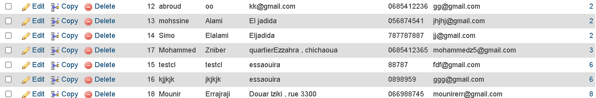
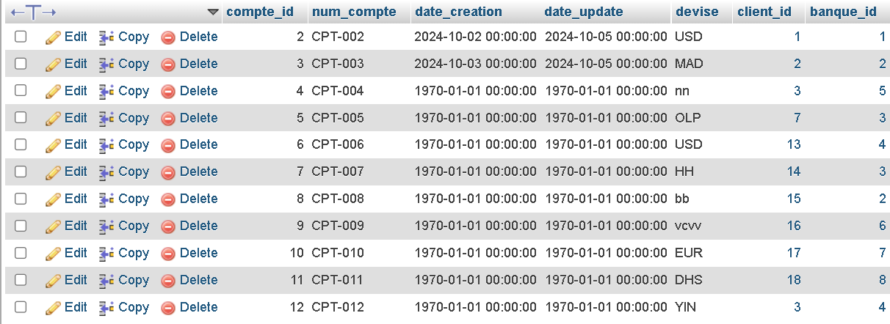
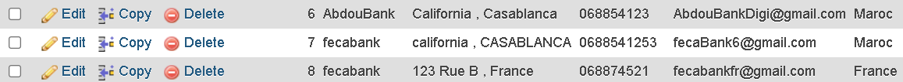
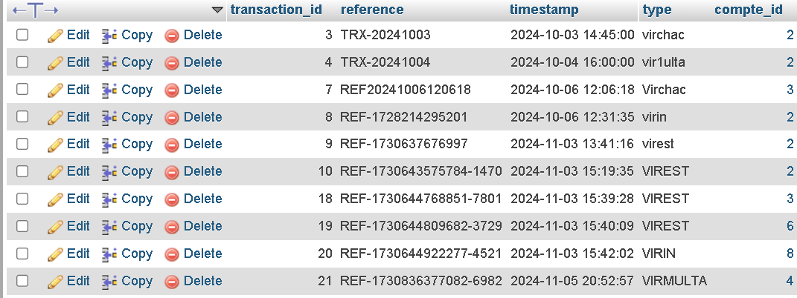
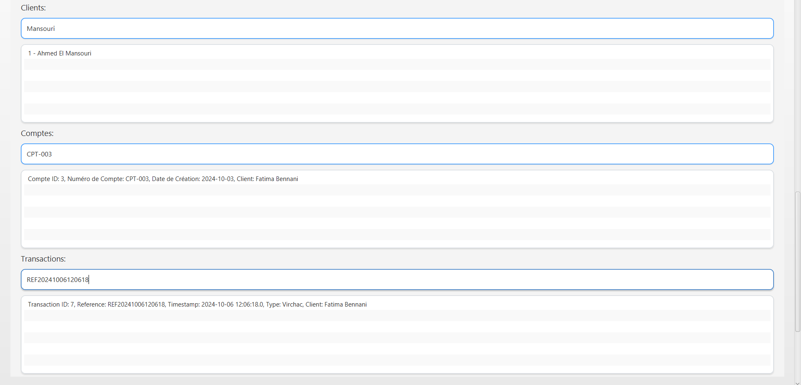

Petit vidéo de démonstration : 
[vid](vidproject.mp4)

Partie UI :

Tables de base de données : 
Table de clients : 

Table de comptes : 

Table de banque : 

Table de transactions : 

Recherche de clients : 

